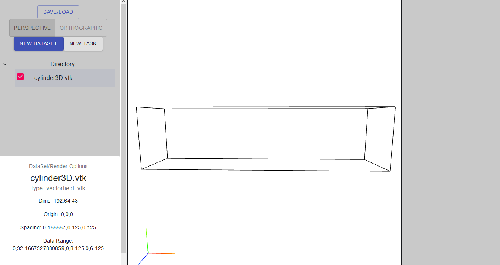

# Setting Up Your First Dataset
After starting the client, select the New Dataset button to load your first dataset file.

There are two dataset loading options:

- #1 Upload the file from your computer

    Select the appropriate File Type, then select Browse to choose the file on your computer

- #2 Select a file from the server

    You will see a list of files available from the server (If you dont, please check the server conenction). A workspace is a saved client state, it can contain multiple datasets and tasks.

Once you select the file, wait for it to be loaded, and if nessesary, submitted to the server for processing.

Once the file is successfully loaded, you will be able to see the rendered bounding box (and other rendering features if available).

