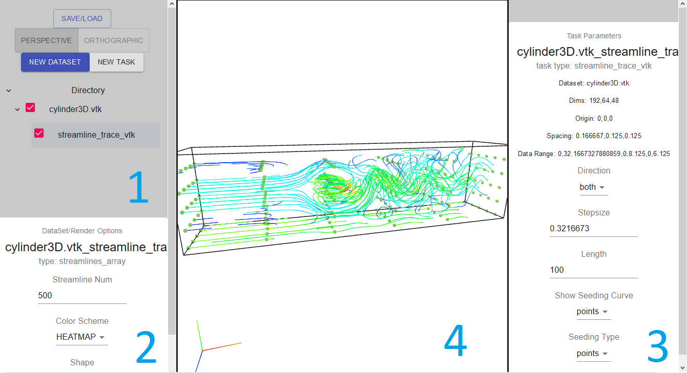

# The User Interface

### #1 Navigation and Menu
- This section contains the main interaction options for the client
- Menu Options:
    - Save/Load: show options to save and load the current state of the client
    - Perspective/Orthographic: change the current camera type
    - New Dataset: add a new parent dataset file to the Directory
    - New Task: add a new task to the currently selected file
    - [Here is more information on how dataset and tasks work](DatasetsandTasks.md)
- Directory:
    - This section contains the main interaction options for the client, a directory tree containing all of the datasets (and the results from performing tasks).
    - The checkbox to the left of the items indicate if the item is being rendered in the Rendering panel (#4)

### #2 Rendering Options Panel
- This panel contains the input parameters to customize the render result of the currently selected dataset in the Directory tree.

### #3 Task Parameters Panel
- This panel contains the input parameters for the currently selected task in the Directory Tree. Some task parameters have render previews (such as the seeding curve points). To apply the parameters, press the blue Apply button at the bottom of the panel (you may need to scroll down).

### #4 Rendering Panel
- This is where all rendering results are rendered.
- Left mouse to rotate, right mouse to pan, scroll to zoom